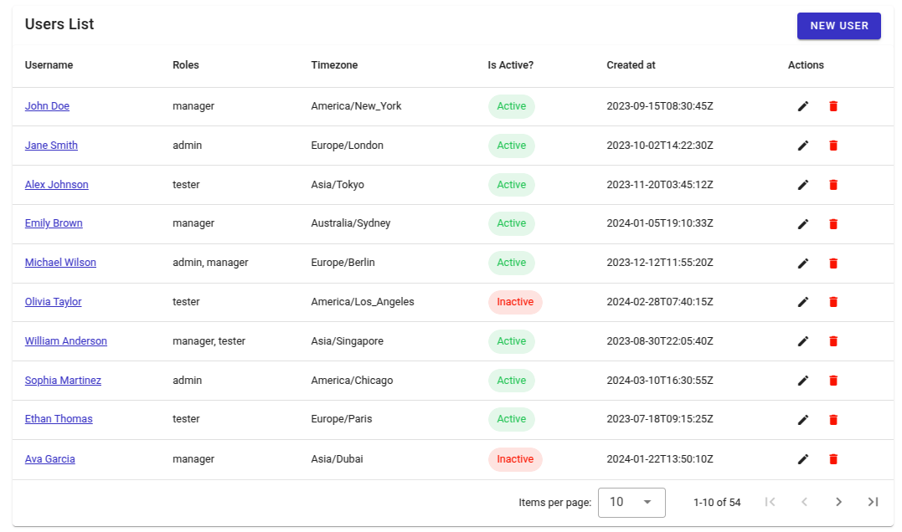
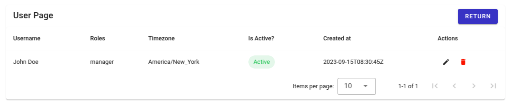

## Instructions

The application was developed with:

```
Python 3.8.10  

Node v20.16.0 and pnpm 9.7.1
```

Inside the `python` directory is the source code to the back-end and the `vue-app` directory contains the front-end code.


## Run the app

### Back-end

Make sure to have installed the Python libraries used in the project, which are documented in the `requirements.txt` file, before running the back-end code. Navigate to the `python` folder and run the following command: `pip install -r requirements.txt`

After this, you may run the main code of the `parser.py` file with

```
python parser.py

or

python3 parser.py
```

This should first create the database (collection "users", if it doesn't already exists) and then connect to it. After that, it should fetch the data from the `udata.json` file and then populate the MongoDB database. If everything is okay, it should display the message "Users imported successfully!" in the terminal.

To start the API server, run 

```
python api.py

or

python3 api.py
```

This should start de the Flask app, with Debug mode turned on, and all the data should be avaiable on the address `http://localhost:5000/users`


### Front-end

To view the interface, also make sure to install the dependencies. Navigate to the `vue-app` directory and then run the command `pnpm install`

With all dependencies installed, run `pnpm dev` and the interface should be avaiable on  `http://localhost:3000`, to access the app, navigate to the `/users` endpoint.

## About the code test

The features that could be developed were:

- Creating and connecting to a MongoDB database
- Fetching and parsing the data from `udata.json`
- Insert the fetched data into the database successfully
- The main page containing a table with all users and the main columns requested (except for "Last Updated At"); also "Created At" column could not be properly formatted
- Buttons for user actions: "new user", "edit" and "delete" buttons (only the delete button is functional)
- The individual user page with the same informations as the main page
- A specific button in the individual user page for returning to the main page

Some images of the actual application:






